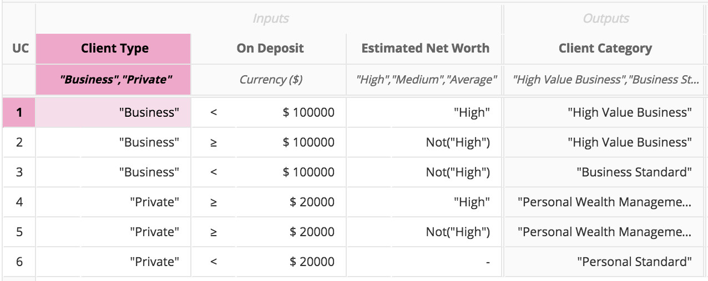
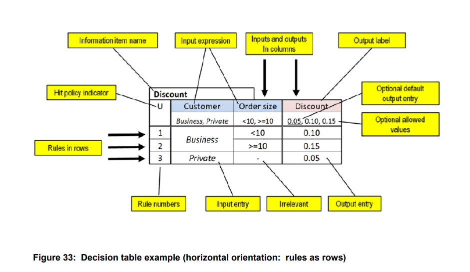
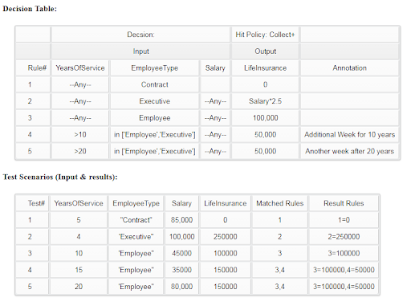

Business-Rules Engine
===========

## Condition Symbols

- Column Value: `$$` example DateDiff($$,@now)
- variable symbol: `$`example: `$caseId`  this is needed since we allow multi words operations like `starts with`
- Is null value or empty: `Null` or `Empty`
- Any Value: `-`

- All types:
  - `null`  or `empty`
  - `not null`
  - `true` or `false`


<table>
<tr><th>Type </th><th>Syntax</th><th>Examples</th></tr>
<tr><td rowspan=4>Numbers</td><td>value</td><td>500</td></tr>
<tr><td rowspan=3>compare operator</td><td>>500</td></tr>
<tr><td><500</td></tr>
<tr><td>between 500 and 700</td></tr>

<tr><td rowspan=6>String</td><td>value</td><td>Low-Income</td></tr>
<tr><td>Quoted Value</td><td>'Low-Income'</td></tr>
<tr><td rowspan=4>string operators</td><td>starts with 'Low'</td></tr>
<tr><td>ends with 'Income'</td></tr>
<tr><td>contains 'Income'</td></tr>
<tr><td>not 'Low-Income'</td></tr>


<tr><td rowspan=6>Date</td><td>Quoted value</td><td>'2020/12/01'</td></tr>
<tr><td rowspan=5>Date operators</td><td>after '2020/12/01'</td></tr>
<tr><td>>30 days</td></tr>
<tr><td><10 years</td></tr>
<tr><td>contains 'Income'</td></tr>
<tr><td>not 'Low-Income'</td></tr>

</table>

[](http://www.repostatus.org/#active)

## Introduction
Is a Business Rules Engine supporting DMN Decision Tables.
Allowing developers to integrate Rules into JavaScript or Node.js applications.

This solution utilizes deterministic rules vs Rete based solutions that are non-deterministic.

This package is designed specifically for Node.js and TypeScript

As an example of Decisition Table 




## Usage
### Definition

    Decision table can be defined as a JSON or CSV file
### Invoke
To invoke the above example
```js
    const Rules=requires('./business-rules.json')'
    const dt= Rules.load('client-category);
    let result=dt.run({type:'Private',  deposit: 500 , netWorth: 500});

    console.log(result.category);
```
### Testing
```js
    const tester=Rules.loadTest('./client-category-tests.json');
    let results=tester.run();
    console.log(results.summary);
```

### UI for Testing and expeirmenting


## Rule Syntax

### Conditions
#### Expression Language

#### Simple Conditions shortcuts

- Literal values with or without quotes, so `"high"` and `high` are acceptable

- coditional operators and functions without referencing the variable like `>500`

- Empty Condition or `-` indicates all values are true
- For numeric variables:
  - > 500 
  - between 500 and 700
- For Date variables, functions like:
  - `> 30 days` , `> 50 minutes` , `< 10 years` etc.
  - `before '2018/01/01'` or `after '2018/03/01'`
  - `between '2018/01/01' and '2019/12/31'`
  - 
#### Complex Conditions
- And , Or and Not operators, brackets `()` can also be used
- 
- complex operations and functions can reference the variable using `@` symbol

### Output
    Output expressions can use the full expression language and reference any input or ouput variable.

## Expression Engine 
```js

    const exp=new Expression(`2+3*4`);
    const result= expr.evaluate();
    console.log(result);

```
Expressions are compiled into AST 
```js
    const exp=new Expression(`2+3*4`);
    const compiled= expr.compile();

    // or reloaed

    const expr=Expression.load(compiled);
    const result= expr.evaluate();

    console.log(result);
```

# Language Constructs
## Literals
- Strings: 'John'
- Numbers: 123.25

## Words
salary

customer.address

## Operators
The package already defines a set of operators but you can add your own
### Operator Symbols
`+` `-' `*` `/` etcs.

### Word Operators
`between` is defined as a word operator


## Functions

## Keywords

The following literals are defined as Keywords

-`true`
-`false`
-`null`

